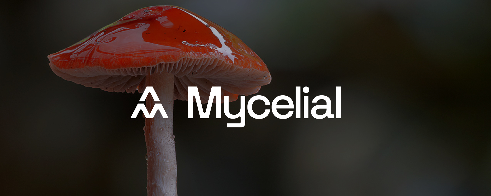

# Hello 👋

We are [Mycelial Inc.](https://mycelial.com), a maker of local-first software
development libraries.

> What's local-first software?

Up until recently, you had two options when creating an application:
- Local applications and
- Client/server applications

Each of these types of applications has its strengths (and weaknesses). For
example, local apps are typically fast because they don't need to talk to
servers over slow networks. However, if your app needs multiple users to
collaborate on common tasks, then a local application won't work for you; you'll
probably need to create a client/server application, right? Well, maybe, but now
a third option allows you to combine many of the best features from local and
client/server applications. It's a new, best-of-both-worlds paradigm.

Checkout this [README](https://github.com/mycelial/mycelial-js) to learn more.

If you'd like to chat about our libraries, we welcome you to join [our
Discord](https://discord.gg/mycelial) or contact us on
[twitter](https://twitter.com/@mycelial).
